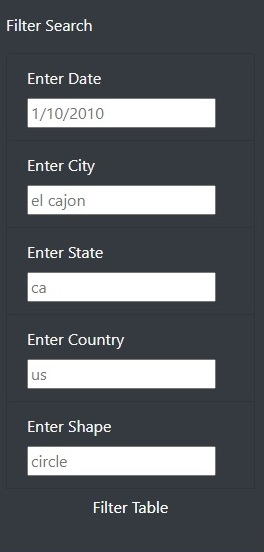
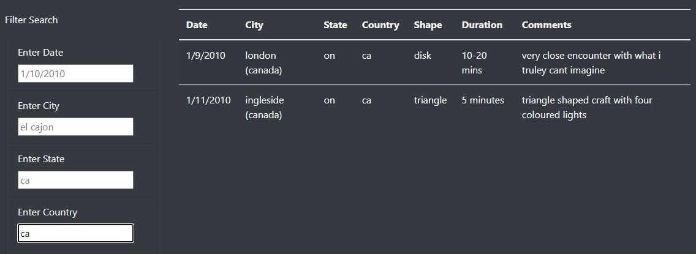
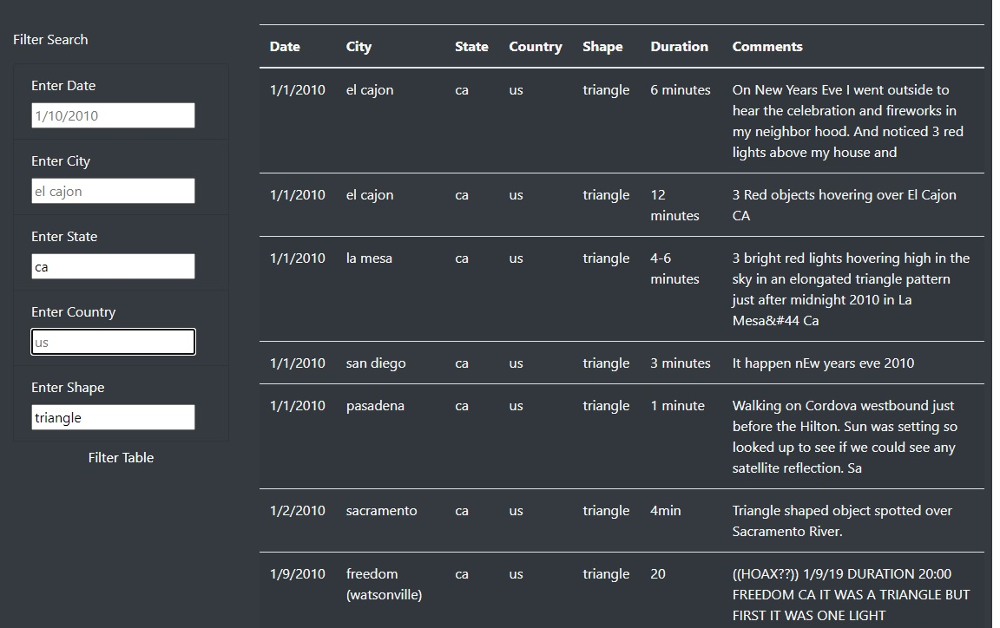

# UFS Sightings Data from across the World

## Overview of the project

An interactive website based on a Javascript dataset containing information pertaining to UFO sightings was requested.  The requestor, Dana, is a data journalist who wants to showcase her hometown and their obsession with UFOs.

The website will be customized using Bootstrap, which makes it easy to organize the contents of a website by defining a grid system to lay out your content. At the same time, Javascript will provide the ability to create custom filtering options to make the data table interactive and easier to digest.

An interactive website has many different components, including the base HTML code, usually stored in a file named index.html, style sheets that help coordinate the look of all of a website's pages, and a program that responds to the user's actions by modifying the content of the website. 

Javascript is a popular program used for web development because it has robust functionality.  As well as being able to write your own functions to perform a multitude of actions, there are many Javascript libraries that you can use that are already written and tested.  In addition, Javascript doesn't require anything to be loaded on the users' platform.  Instead, it performs all of its work in the background.  Finally, adding a connection to a website is easy.  You can either embed the code within the HTML or, for a more streamlined look, reference the code and its location for the connection to be made.

## Results

The webpage has three primary sections: article, filtering options, and data table.

The article written by Dana is prominently displayed on the top right side of the website, with the title to the left.  This structure mimics the presentation of journal articles in newspapers. 
 #### Screen Shot of the Article Title and Article

The Filter Search options are given in a list below the article.  There are five filter options, and each text box contains an example of how to structure the entered information. 

#### Screen Shot of the Filter Option Text Boxes

The data table is on the right of the Filter Search options.  Each time a Filter option is changed, the data table is refreshed, showing the results of the Filters.
 #### Screen Shot of the Table with a Search Results of Country = Canada

Data can be filtered by five columns: date, city, state, country, and UFO shape.  Once you enter something into any filter text boxes, the data table will be refreshed, limiting the displayed data to match the filtering request.

 #### Screen Shot of the Table with a two level Search of State = California and Shape = triangle

## Discussion

People can become frustrated if all of their searches result in no findings.  Clear communication of the data’s contents would forestall many of those types of searches.  For example, including a range of dates for which data are available would be good. Another example is to change elements with only a few options, i.e., country and shape a drop-down box.  Country only has two options and would be perfect for a drop-down list.  While there are more shapes, people may be unfamiliar with the various options that are available for UFO shapes within the data table. Limiting the entry to those shapes would make the website more user-friendly.
  
The unusual lowercase storage of City, State, and Country names can also create a user entry error.  Most individuals are accustomed to providing that information in either capital or upper case.  To ensure that using a wrong case would not cause a problem, I was proactive and added lowercase and trim functions to the data inputs.

